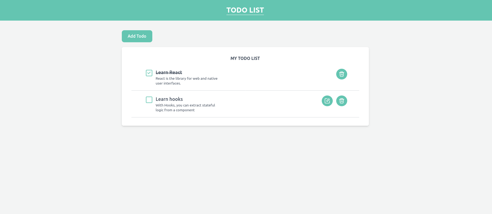

# TODO List By React

## Available Scripts

In the project directory, you have to run:
### `npm install`

to install npm and then run
### `npm start`

Runs the app in the development mode.\
Open [http://localhost:3000](http://localhost:3000) to view it in your browser.

## Output
